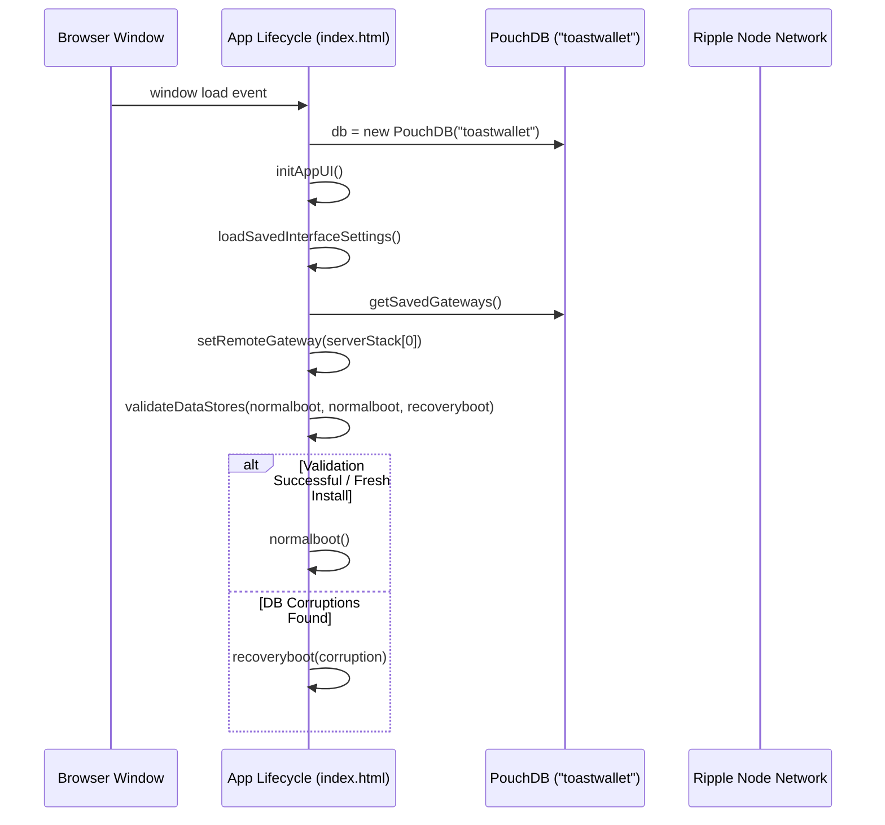
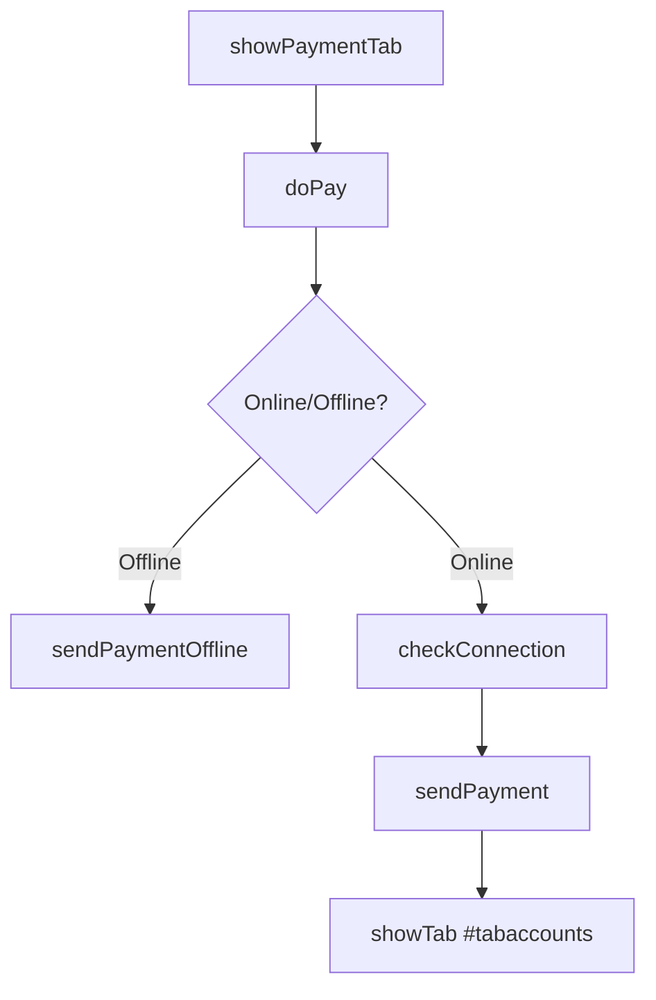

# Toast Wallet Core API Reference

This document provides a comprehensive developer reference for the **Toast Wallet Core** codebase under [www](file:///root/downloads/core/www). Toast Wallet is a single-page HTML5/JavaScript web application built on top of the XRP Ledger. All application logic, database management, and cryptographic routines are encapsulated within [index.html](file:///root/downloads/core/www/index.html) and modular utility libraries.

> [!NOTE]
> Toast Wallet is legacy software and no longer actively maintained. This documentation is provided for maintenance, audits, and migration purposes.

---

## Table of Contents

1. [Architectural Overview](#architectural-overview)
2. [Global State & Environment Configuration](#global-state--environment-configuration)
3. [Core Utilities Module (`rippleutils`)](#core-utilities-module-rippleutils)
4. [Database Schema & Cryptography](#database-schema--cryptography)
5. [Cryptographic Function Usage Analysis](#cryptographic-function-usage-analysis)
6. [API Function Reference](#api-function-reference)
   - [Boot, Fresh Install & Validation Flow](#boot-fresh-install--validation-flow)
   - [Backup, Export & Restore](#backup-export-restore)
   - [PIN & Passphrase Security Management](#pin--passphrase-security-management)
   - [Account Administration](#account-administration)
   - [XRP Ledger Transactions (Online & Offline)](#xrp-ledger-transactions-online--offline)
   - [Address Processing & Translation](#address-processing--translation)
7. [Interactive UI Navigation & Function Call Paths](#interactive-ui-navigation--function-call-paths)
8. [Developer & Build Utilities](#developer--build-utilities)

---

## Architectural Overview

Toast Wallet follows a single-page web application design. The architecture rests on three main pillars:
* **The Single-Page Client:** Managed entirely inside [index.html](file:///root/downloads/core/www/index.html), handling both UI (using jQuery Mobile and Bootstrap) and controllers.
* **A Local Storage Engine:** Powered by PouchDB (`toastwallet` instance) using WebSQL or IndexedDB.
* **Cryptographic Layer:** Secured using Libsodium via `sodium.js` (for PIN and passphrase hashing and database encryption) and `ripple-lib` for transactions.

```mermaid
graph TD
    A[index.html (UI & Controllers)] --> B[PouchDB Database 'toastwallet']
    A --> C[sodium.js (Encryption & Hashing)]
    A --> D[ripple-lib (XRP Node Connection)]
    A --> E[rippleutils-build.js (Custom Serializers)]
```

---

## Global State & Environment Configuration

The wallet retains several global variables to manage connectivity, test nets, transaction reserve amounts, and UX layouts:

| Variable | Type | Description |
| :--- | :--- | :--- |
| `debug` | `boolean` | Enables console logging if set to `true`. |
| `ontestnet` | `boolean` | Configures the Ripple API connection string to target XRP Testnet vs Mainnet. |
| `emergencybackup` | `boolean` | Flags whether a backup is required immediately. |
| `offlinemode` | `boolean` | Determines if connection attempts to Ripple nodes should be bypassed. |
| `toastepoc` | `number` | The starting XRP Ledger sequence (`36225052`) used for offline code references. |
| `xrpreserve` | `number` | Minimum account reserve (default: `20` XRP). Updated dynamically from the server. |
| `interface_settings` | `object` | Handles styling options like `display_xaddresses` (X-address format). |

---

## Core Utilities Module (`rippleutils`)

A custom Node module is browserified from [rippleutils.js](file:///root/downloads/core/utils-build/rippleutils.js) to compile the web assembly bundle [rippleutils-build.js](file:///root/downloads/core/www/js/rippleutils-build.js).

This library was originally based on the legacy `ripple-lib` client library. For up-to-date client library implementations and references, see:
* [XRPL Official Client Libraries Documentation](https://xrpl.org/docs/references/client-libraries)
* [xrpl.js GitHub Repository](https://github.com/XRPLF/xrpl.js)

It attaches the following libraries to the global `window` context:
* `assert`, `elliptic`, `secp256k1`, `rippleKeypairs`, `rippleAddressCodec`, `rippleBinaryCodec`, `rippleHashes`
* `BN` (BigNumber support via `bn.js`) and `hashjs`

### Namespace: `window.utils` (from [utils.js](file:///root/downloads/core/utils-build/utils.js))

* #### `utils.bytesToHex(bytes)`
  Converts a `Uint8Array` byte array into a capitalized Hex string.
* #### `utils.hexToBytes(hex)`
  Converts Hex string into a standard byte array.
* #### `utils.computePublicKeyHash(publicKeyBytes)`
  Computes the double-hash of the public key byte sequence (`RIPEMD160(SHA256(pubkey))`).
* #### `utils.seedFromPhrase(phrase)`
  Generates a 16-byte cryptographic seed from a passphrase using SHA-512.

---

## Database Schema & Cryptography

### PouchDB Document Store

Toast Wallet uses a single PouchDB database named `'toastwallet'`. It stores JSON-serialized configuration objects under the following document keys:

```
┌─────────────────────────┐
│     PouchDB Stores      │
├─────────────────────────┤
│ 1. pindata              │ ──> PIN salt and short hash
│ 2. ppdata               │ ──> Passphrase encryption keys & salt
│ 3. rpdata               │ ──> Recovery phrase encryption keys, salt, & ERK
│ 4. accounts             │ ──> Map of Ripple addresses and encrypted seeds
│ 5. lastbackupreminder   │ ──> Timestamp of the last backup prompt
└─────────────────────────┘
```

#### 1. `pindata` Schema
Stores the short hash of the user's PIN:
```json
{
  "salt": "checksummed_hex_string",
  "hash": "checksummed_hex_string"
}
```
* **Derivation:** Generates `salt` using `sodium.randombytes_buf(sodium.crypto_shorthash_KEYBYTES)`. The hash is derived using `sodium.crypto_shorthash(pin, salt)`.

#### 2. `ppdata` & `rpdata` Schema
Stores salt credentials and intermediate keys for encryption:
* **Salt Length:** 72 hex characters.
* **Hash Length:** 40 hex characters.
* **Encryption Key (`erk`):** Encrypted Recovery Key. Derived using scrypt salsa (`sodium.crypto_pwhash_scryptsalsa208sha256`) with `OPSLIMIT_INTERACTIVE` (4) and `MEMLIMIT_INTERACTIVE` (32MB).

#### 3. `accounts` Schema
Stores a dictionary mapping XRP Classic addresses (`r-addresses`) to their encryption containers:
```json
{
  "rAddressHere...": {
    "ppsalt": "salt_derived_via_passphrase",
    "ppsecret": "secretbox_encrypted_seed_with_nonce",
    "rpsalt": "salt_derived_via_recoveryphrase",
    "rpsecret": "secretbox_encrypted_seed_with_nonce",
    "nickname": "Account Name Label"
  }
}
```

> [!IMPORTANT]
> The raw Ripple seed (secret key) is encrypted in two separate boxes: one locked by the user's **Passphrase** (`ppsecret`) and one locked by their **Recovery Phrase** (`rpsecret`).

### Cryptographic Helpers

All stored secrets use custom checksum wrappers:
* #### `tohex_chksum(data)`
  Prepends the first 8 hex characters of `sodium.crypto_generichash(4, data)` to the hex representation of the data.
* #### `fromhex_chksum(hex, format)`
  Verifies the 8-character checksum prefix against the hash of the payload. Returns the original bytes or string, or `false` if corrupt.

---

## Cryptographic Function Usage Analysis

Toast Wallet core utilizes two main suites for cryptographic features: **Libsodium** (`sodium.js`) for data storage/key security, and **Ripple Cryptographic Libraries** (`ripple-lib` & custom utilities) for transactions and address formats.

### 1. Libsodium Cryptographic API (`sodium.js`)

| Cryptographic Function | Mathematical Routine | What it Does | Purpose in the Application |
| :--- | :--- | :--- | :--- |
| `sodium.crypto_shorthash(pin, salt)` | SipHash-2-4 | Hashes input strings (PINs) using a 16-byte key (salt) into an 8-byte authentication digest. | Registers and validates the client's local login PIN stored inside the `pindata` document. |
| `sodium.crypto_pwhash_scryptsalsa208sha256(key_len, password, salt, opslimit, memlimit)` | scrypt key derivation | Derives a cryptographically strong 32-byte key from human passphrases/passwords. | Derives the symmetric master key used to encrypt the user's recovery phrase and Ripple seed accounts. |
| `sodium.crypto_secretbox_easy(message, nonce, key)` | XSalsa20 + Poly1305 (Authenticated Encryption) | Encrypts a message symmetrically using a 24-byte random initialization vector (nonce). | Encrypts private account keys (seeds) and recovery keys before saving them to the database. |
| `sodium.crypto_secretbox_open_easy(ciphertext, nonce, key)` | XSalsa20 + Poly1305 (Decryption) | Decrypts a ciphertext symmetrically after verifying its Poly1305 integrity tag. | Decrypts Ripple private seeds to authorize transactions or reveal account credentials. |
| `sodium.crypto_generichash(hash_len, data, key)` | BLAKE2b | Generates a secure, collison-resistant cryptographic hash of the input payload. | Computes 4-byte integrity prefixes used in the `tohex_chksum` data wrappers and wallet export strings. |
| `sodium.randombytes_buf(size)` | OS-level CSPRNG | Fills a target buffer with cryptographically secure random bytes. | Generates initialization vectors (nonces) and unique salts for each account seed. |
| `sodium.randombytes_random()` | OS-level CSPRNG | Generates a cryptographically secure 32-bit random integer. | Generates random indices to select pronounceable syllables for new recovery phrases. |

---

### 2. Ripple Ledger Cryptographic API (`ripple-lib` & Custom Utilities)

| Cryptographic Function | Mathematical Routine | What it Does | Purpose in the Application |
| :--- | :--- | :--- | :--- |
| `remote.sign(txJSON, secret)` | ECDSA (secp256k1) / Ed25519 | Cryptographically signs a prepared transaction object using the account's private seed. | Signs payments, flags, and DEX orders online or offline before network submission. |
| `rippleKeypairs.deriveAddress(publicKey)` | Hash160 (Base58Check) | Converts a public key coordinate into a standard Ripple Classic address (`r-address`). | Derives public identifiers for newly created or imported accounts. |
| `rippleKeypairs.deriveKeypair(seed)` | ECDSA / Ed25519 keypair derivation | Derives public and private key coordinate parameters from a Ripple private seed. | Establishes the signing coordinates needed to authorize outgoing transactions. |
| `rippleAddressCodec.decodeAccountID(address)` | Base58Check decoder | Decodes base58 addresses into their raw 20-byte account hash components. | Validates addresses, supporting X-address and classic address translation. |
| `hashjs.sha256()` | SHA-256 | Computes standard 32-byte hash digests. | Performs intermediate hashing of public key bytes. |
| `hashjs.ripemd160()` | RIPEMD-160 | Computes standard 20-byte hash digests. | Derives AccountID digests from public key sha256 bytes. |
| `hashjs.sha512()` | SHA-512 | Computes standard 64-byte hash digests. | Derives standard entropy seeds from passphrases inside [utils.js](file:///root/downloads/core/utils-build/utils.js). |

---

## API Function Reference

All functions reside under the global JavaScript context in [index.html](file:///root/downloads/core/www/index.html).

### Boot, Fresh Install & Validation Flow

* #### `validateDataStores(funcok, funcnodata, funcdatacorrupt)`
  Performs integrity checks on database records (`pindata`, `ppdata`, `rpdata`, `accounts`).
  * **Success Callback:** `funcok()` runs if data exists and is valid.
  * **Missing Callback:** `funcnodata()` runs if no records are found (fresh install).
  * **Failure Callback:** `funcdatacorrupt(details)` runs if any record is malformed.

* #### `normalboot()`
  Initiates the standard startup sequence, loading interface settings and presenting the login PIN pad.

* #### `recoveryboot(corruption)`
  Loads the recovery interface when database corruption is detected, prompting the user to rebuild from their recovery phrase.

* #### `__freshinstall()`
  Wipes existing PouchDB records and routes the user to the initial setup and PIN selection screens.

### Backup, Export & Restore

* #### `exportWallet(exportfunc)`
  Serializes `pindata`, `ppdata`, `rpdata`, and `accounts` into a single JSON object, prepends an 8-character hash check, and triggers `exportfunc(payload)`.

* #### `importWallet(wallet, successfunc, failurefunc)`
  Validates a serialized export string's checksum, parses it, and writes the contents back to PouchDB. Returns database states to original values if transaction updates fail.

* #### `doCheckBackup(raw)`
  Verifies if the backup string format matches the generic hash format and returns parsed properties.

* #### `doRestoreBackup()`
  Triggers the file/text import dialog to recover a wallet.

### PIN & Passphrase Security Management

* #### `setPin(pin, successfunc, failfunc)`
  Hashes the raw PIN string using `sodium.crypto_shorthash` and saves it to PouchDB.

* #### `validatePin(pin, successfunc, failfunc, nopinsetfunc)`
  Validates the user input PIN. Executes `successfunc` on match, `failfunc` on mismatch, or `nopinsetfunc` if no PIN exists.

* #### `validatePassphrase(passphrase, isrecoveryphrase, successfunc, failurefunc, nopassphrasefunc)`
  Verifies whether the passphrase (or recovery phrase) is valid by testing if it can derive the expected key.

* #### `setPassphrase(newphrase, oldphrase, issettingrecoveryphrase, successfunc, failurefunc, firstrun)`
  Updates the passphrase or recovery phrase. **Crucial:** Iterates and decrypts all account secrets using keys derived from the old phrase, then encrypts them using keys derived from the new phrase before updating `ppdata`/`rpdata`.

### Account Administration

* #### `getAccounts(callback)`
  Retrieves the list of active accounts from the database and runs the callback: `callback(accounts)`.

* #### `importAddress(secret, address, nickname, passphrase, successfunc, failurefunc)`
  Imports a Ripple seed. Automatically verifies that the seed matches the classic address. If the network is connected, it verifies if the master key has been disabled. Saves the result inside the `accounts` database object under both passphrase and recovery phrase encryption containers.

* #### `generateAddress(secret)`
  Generates a valid XRP public key and `r-address` sequence from a private seed key using `rippleKeypairs.deriveAddress`.

* #### `changeNickname(address, nickname, successfunc, failurefunc)`
  Edits the client-side name tag associated with the specified XRP address.

### XRP Ledger Transactions (Online & Offline)

* #### `connectToRipple(funcsuccess, suppressbootsequence)`
  Initializes `ripple-lib`'s `RippleAPI` connection to the remote cluster node.

* #### `submitSignedTransaction(signedTransaction, successfunc, failurefunc, tries)`
  Submits a pre-signed transaction hex directly to the connected Ripple node. Tries alternate servers on network failures.

* #### `sendPayment(passphrase, fromacc, xrpAmount, destination, sourceTag, destTag, invoiceID, asset, issuer, successfunc, failurefunc)`
  Generates, signs, and broadcasts a standard Ripple Payment transaction. Supports custom assets, issuers, destination tags, and invoice IDs.

* #### `sendPaymentOffline(passphrase, fromacc, xrpAmount, destination, sourceTag, destTag, invoiceID, asset, issuer, accSeqID, ledSeqID, fee)`
  Builds and signs a payment transaction offline, returning a raw signed tx hex and QR code image payload without querying the network.

* #### `sendAccountFlagsTx(passphrase, fromacc, defaultRipple, depositAuth, disableMasterKey, disallowIncomingXRP, globalFreeze, noFreeze, requireAuthorization, requireDestinationTag, successfunc, failurefunc)`
  Modifies XRP account configuration flags (e.g., enabling destination tags or disabling the master key).

* #### `sendTrustLineTx(passphrase, fromacc, issuer, currency, limit, rippling, successfunc, failurefunc)`
  Creates or modifies an XRP Ledger trustline for non-XRP assets.

* #### `sendOfferCreate(passphrase, fromacc, amount, asset, issuer, price, sell, fok, ioc, passive, expiry, successfunc, failurefunc)`
  Submits a currency exchange offer order to the XRP decentralized exchange (DEX).

* #### `sendOfferCancel(passphrase, fromacc, seq, successfunc, failurefunc)`
  Cancels a pending DEX offer order matching the sequence ID `seq`.

### Address Processing & Translation

* #### `xaddr(raddr, tag)`
  Translates a standard classic `r-address` and optional destination tag into a unified Ripple X-address.

* #### `raddr(xaddr)`
  Decodes an X-address back into its constituent `r-address` and destination tag components.

* #### `isXAddress(x)`
  Returns `true` if the string matches the unified X-address format specifications.

* #### `validateAddress(x)`
  Checks if the address is a syntactically valid Ripple X-address or classic R-address.

* #### `validateSecret(x)`
  Checks if the private key matches the standard Ripple seed base58 schema.

---

## Interactive UI Navigation & Function Call Paths

Toast Wallet core is built as a single-page app where UI views are HTML container elements tagged with the `.screentab` class (e.g., `#tabaccounts`). Navigation and state transitions are systematically managed via the global function `showTab(tabId)`.

### 1. Application Launch & Initialization Path

When the HTML5 web application loads, the entry point listener registers the bootstrap sequence:



1. **Inbound Trigger:** The document event listener captures the loading sequence and calls the initialization routine.
2. **PouchDB Instance:** Instantiates the local WebSQL/IndexedDB backend: `db = new PouchDB('toastwallet')`.
3. **Configuration Loading:** Triggers `loadSavedInterfaceSettings()` and fetches custom user gateway configurations via `getSavedGateways(callback)`.
4. **Data Integrity Check:** Invokes `validateDataStores(normalboot, normalboot, recoveryboot)`.
   - **Case A (Success/Fresh Install):** Triggers `normalboot()`.
   - **Case B (Database Corruption):** Triggers `recoveryboot(corruption)`.

---

### 2. Startup Setup (Fresh Install Path)

When a fresh installation is detected, the user is routed to terms acceptance and new credentials generation:

* **Entry point:** `normalboot()` checks PIN existence with `validatePin("", ...)` which executes the `nopinsetfunc` callback.
* **Interactive Path:**
  1. **License Screen:** Opens `#tablicense`.
  2. **Accept License:** User clicks the "Create a New Wallet" button (`#btnbootstrapsequence`), triggering:
     ```javascript
     () => {
         setupcompletedthissession = true;
         doResetPin('', function(){ showTab('#tabsetpassphrase'); }, function(){}, true);
     }
     ```
  3. **PIN Registration:** `doResetPin()` starts the double-pass PIN pad flow using `runPinPad()`:
     - Prompts first PIN: `#tabpinset1`.
     - Prompts confirm PIN: `#tabpinset2`.
     - Sets the PIN: `setPin(pin2, successfunc)`.
  4. **Passphrase Setting:** Redirects to `#tabsetpassphrase`. When the user enters their passphrase and clicks "Set Passphrase" (`#btnsetpassphrase`), it triggers:
     ```javascript
     doResetPassphrase(password, repeatPassword, '', successfunc)
     ```
     - Validates password complexity: `passphraseComplexityCheck(pp)`.
     - Encrypts parameters and updates database files: `setPassphrase()`.
     - Fires success callback: `setAndShowNewRecoveryPhrase(passphrase)`.
  5. **Recovery Phrase Generation:** `setAndShowNewRecoveryPhrase()` generates 6 random words using the Libsodium random generator:
     ```javascript
     word += arr[sodium.randombytes_random() % arr.length];
     ```
     - Saves the phrase to database: `setPassphrase(recoveryphrase, passphrase, true, successfunc)`.
     - Switches view to `#tabshowrecovery`.
  6. **Finish Setup:** User checks the warning toggles and clicks `#btnfinishedsetup`, invoking `doFinishSetup()`. It clears the recovery phrase text string from DOM memory and routes to the home accounts panel via `showTab("#tabaccounts")`.

---

### 3. Add / Generate Ripple Address Path

From the dashboard view (`#tabaccounts`), the user clicks the "+" button (`#btnaddaccount`) which calls `showTab('#tabaddaccount')`.

#### Path A: Generate a New Address
1. User clicks "Generate New Address", which runs `doShowAndGenerateAccount()`.
2. Generates new keypair: `generatedAccount = generateAddress()`.
3. Displays a masked address string using `dispaddr()` and moves to `#tabgenaccount`.
4. User inputs their passphrase to confirm, triggering:
   `doImportGeneratedAccount(passphrase, nickname)` -> `validatePassphrase()` -> `importAddress()` -> `showTab('#tabaccounts')`.

#### Path B: Import Existing Secret (Seed)
1. User clicks "Add Existing Address", routing to `#tabaddexistingaccount`.
2. User enters their Ripple secret key (seed), optional address, nickname, and passphrase, then clicks `#btnimport`, running:
   `doImportExistingAccount(passphrase, nickname, secret, vanityaddr)` -> `doImportGeneratedAccount(passphrase, nickname)` -> `validatePassphrase()` -> `importAddress()` -> `showTab('#tabaccounts')`.

---

### 4. Sending XRP Payment Path

From the dashboard, selecting an account runs `doSelectAccount(address, nickname)` which shows `#tabaccountdetails`. Clicking the bottom navigation bar for payments redirects to the send dashboard:



1. **Pre-populate screen:** User navigates to the payment screen which calls:
   `showPaymentTab(account, currency, issuer, balance)`
2. **Execute Send Request:** User inputs payment details and clicks "Send" (`#btnpay`), triggering `doPay(nonce)`.
3. **Parameters Verification:** `doPay()` validates standard details:
   - Evaluates address constraints via `validateAddress(payto)`.
   - Parses destination tags: `parseDestinationTag()` and `validateDestinationTag()`.
   - Evaluates offline parameters if in offline mode: `validateOfflineCode()`.
   - Checks account ledger balance limit: `checkAccountIsFunded(payfrom, amount, asset, issuer, ...)`.
   - Opens the verification overlay panel: `showTab("#tabpaymentconfirm")`.
4. **Final Confirmation:** User enters their passphrase and clicks the confirmation button, calling `doConfirmPay(passphrase)`:
   - Validates the user's password: `validatePassphrase()`.
   - **Offline Mode:** Generates a signed transaction offline and formats it as a QR code: `sendPaymentOffline(...)`.
   - **Online Mode:** Verifies connectivity via `checkConnection()`, submits signed payload to network cluster via `sendPayment()`.
   - Resets state and redirects back to the main dashboard: `showTab("#tabaccounts")`.

---

## Developer & Build Utilities

### Compile & Build Systems
Toast Wallet's web assets are compiled using npm and browserify:
* **Sub-module Utility Builds:**
  The `rippleutils-build.js` bundle is re-compiled using the script in [update](file:///root/downloads/core/utils-build/update):
  ```bash
  cd utils-build
  npm run build
  browserify rippleutils.js -o rippleutils-build.js
  cp rippleutils-build.js ../www/js/
  ```\n