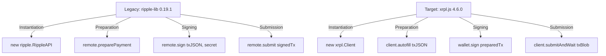

# Toast Wallet Dependency Upgrade & Migration Plan

This document outlines the step-by-step technical plan to upgrade **Toast Wallet Core** dependencies. Specifically, it details migrating from the legacy `ripple-lib` (version 0.19.1) to the modern `xrpl.js` library (version 4.6.0), alongside addressing security vulnerabilities in other outdated utilities identified in [risk.md](file:///root/downloads/core/www/risk.md).

---

## 1. Context & Objectives

According to [ripple-lib-history.md](file:///root/downloads/core/www/ripple-lib-history.md), the client library has been rebranded from `ripple-lib` to `xrpl` (currently at version `4.6.0`). The current codebase relies on legacy API structures, synchronous cryptographic functions, and libraries dating back to 2018. 

### Key Objectives
* **Migrate `ripple-lib` 0.19.1** to `xrpl.js` 4.6.0 to support modern XRP Ledger amendments (such as AMMs, Clawback, and Account Permissions).
* **Patch Security Vulnerabilities:** Resolve prototype pollution and code injection risks by upgrading jQuery, Lodash, PouchDB, and Libsodium.
* **Modernize Cryptography:** Replace the insecure SipHash PIN verification with a memory-hard key derivation function (Argon2id/scrypt) and increase phrase entropy.

---

## 2. Upgrade Matrix

| Dependency | Current Version | Target Version | Primary Rationale |
| :--- | :--- | :--- | :--- |
| **`ripple-lib` / `xrpl.js`** | `0.19.1` | `4.6.0` | Support new ledger amendments, X-Address syntax natively, and modern RPC APIs. |
| **`jQuery`** | `3.3.1` | `3.7.1` | Patch prototype pollution vulnerabilities (CVE-2019-11358). |
| **`Lodash`** | `4.x` (Obsolete) | `4.17.21` | Address critical prototype pollution risks (CVE-2019-10744). |
| **`PouchDB`** | `6.x` (Obsolete) | `9.0.0` | Solve database corruption risks on modern browser and WebView engines. |
| **`Libsodium`** | `sodium.js` (Legacy) | `libsodium-wrappers` | Standard WebAssembly integration, speed optimization, and secure API constants. |
| **`Bootstrap`** | `3.x` | `5.3.3` | Modern flexbox grids, removing outdated jQuery selectors and components. |

---

## 3. `ripple-lib` (0.19.1) to `xrpl.js` (4.6.0) Migration Guide

Modern `xrpl.js` introduces several breaking changes regarding API instantiation, transaction preparation, and signing workflows:



### A. Client Instantiation
* **Old:**
  ```javascript
  remote = new ripple.RippleAPI({ server: serverURL });
  remote.connect();
  ```
* **New:**
  ```javascript
  remote = new xrpl.Client(serverURL);
  await remote.connect();
  ```

### B. Request / Response Conversions
Legacy helper methods must be mapped to direct JSON-RPC requests via `client.request()`:

| Legacy Method | Modern `xrpl.js` Alternative | Occurrences |
| :--- | :--- | :--- |
| `remote.getFee()` | `await client.getFee()` | 1 (L2223) |
| `remote.getAccountInfo(address)` | `await client.request({ command: "account_info", account: address })` | 1 (L2230) |
| `remote.getLedger({})` | `await client.request({ command: "ledger", ledger_index: "validated" })` | 1 (L2234) |
| `remote.getTrustlines(address)` | `await client.request({ command: "account_lines", account: address })` | 1 (L3425) |
| `remote.getOrders(address)` | `await client.request({ command: "account_offers", account: address })` | 1 (L3630) |
| `remote.getOrderbook(from, to)` | `await client.request({ command: "book_offers", taker_gets: from, taker_pays: to })` | 3 (L2424, L3638, L3757) |
| `remote.getSettings(address)` | `await client.request({ command: "account_info", account: address })` + parse `Flags` | 5 (L2860, L3438, L7588, L7625, L8319) |
| `remote.getServerInfo()` | `await client.request({ command: "server_info" })` | 1 (L8246) |
| `remote.generateAddress()` | `xrpl.Wallet.generate()` | 1 (L8089) |
| `remote.connection.request(req, opts)` | `client.request(req)` (timeout via `Client` constructor options) | 1 (L3400) |

> [!WARNING]
> **Private API Access:** Line 3394 sets `remote.connection._timeout = 500` directly — this private internal is removed in `xrpl.js`. Use `new xrpl.Client(url, { timeout: 500 })` or per-request `requestOptions` instead.

### Transaction Preparation Method Mapping

All `remote.prepareXXX` methods are removed in `xrpl.js`. Replace with `client.autofill()` using the native transaction JSON format:

| Legacy Prepare Method | Modern `TransactionType` | Occurrences |
| :--- | :--- | :--- |
| `remote.preparePayment(from, payment, instructions)` | `{ TransactionType: "Payment", ... }` | 2 (L8445, L9188) |
| `remote.prepareSettings(from, settings, instructions)` | `{ TransactionType: "AccountSet", ... }` or `{ TransactionType: "SignerListSet", ... }` | 2 (L8592, L8665) |
| `remote.prepareTrustline(from, trustline, instructions)` | `{ TransactionType: "TrustSet", ... }` | 2 (L8736, L8797) |
| `remote.prepareOrder(from, order, instructions)` | `{ TransactionType: "OfferCreate", ... }` | 2 (L8889, L8972) |
| `remote.prepareOrderCancellation(from, cancel, instructions)` | `{ TransactionType: "OfferCancel", ... }` | 2 (L9032, L9100) |

**Signing pattern migration** — all 10 instances of this pattern must be rewritten:
```javascript
// Old (10 occurrences across L8447-L9190)
const {signedTransaction} = remote.sign(prepared.txJSON, secret);
// New
const wallet = xrpl.Wallet.fromSeed(secret, { algorithm: "secp256k1" });
const signed = wallet.sign(prepared);
```

### C. Address & Keypair Derivation
* **Old:**
  ```javascript
  const address = rippleKeypairs.deriveAddress(pubkey);
  const keypair = rippleKeypairs.deriveKeypair(seed);
  ```
* **New:**
  ```javascript
  const wallet = xrpl.Wallet.fromSeed(seed);
  const address = wallet.classicAddress;
  const keypair = wallet.privateKey;
  ```

### D. Transaction signing & submission
Modern `xrpl.js` uses an autofill structure and does not require preparing separate transaction payloads.
* **Old:**
  ```javascript
  remote.preparePayment(from, payment, specs).then(prepared => {
      const { signedTransaction } = remote.sign(prepared.txJSON, secret);
      remote.submit(signedTransaction);
  });
  ```
* **New:**
  ```javascript
  const wallet = xrpl.Wallet.fromSeed(secret);
  const prepared = await remote.autofill({
      TransactionType: "Payment",
      Account: from,
      Amount: xrpl.xrpToDrops(amount),
      Destination: destination,
      DestinationTag: destTag
  });
  const signed = wallet.sign(prepared);
  const response = await remote.submitAndWait(signed.tx_blob);
  ```

---

## 4. Specific v0.19.1 to v4.6.0 Migration Warning Details

Because Toast Wallet is upgrading directly from `ripple-lib` version **0.19.1**, several additional API changes must be monitored carefully to prevent logical bugs:

> [!IMPORTANT]
> The transition from pre-1.0 (v0.19.1) to v4.6.0 involves a change in variable cases (camelCase to snake_case) and units (XRP string vs drops string).

### 1. `getFee()` Unit Conversion Change
* **v0.19.1 Behavior:** `remote.getFee()` returns the transaction fee in **XRP** as a string (e.g. `"0.000012"`).
* **v4.6.0 Behavior:** `client.getFee()` returns the transaction fee in **Drops** as a string (e.g. `"12"`).
* **Attention:** If the modern fee string is processed using old logic expecting XRP values, it will result in calculation errors or extremely inflated fees. Ensure drops are converted using `xrpl.dropsToXrp()` where appropriate.

### 2. `getServerInfo()` Response Mapping
* **v0.19.1 Structure:** Returns a camelCase object:
  ```javascript
  info.validatedLedger.reserveBaseXRP
  ```
* **v4.6.0 Structure:** Returns a nested snake_case object:
  ```javascript
  info.info.validated_ledger.reserve_base_xrp
  ```
* **Attention:** Refactor the connection handler in [index.html#L8246](file:///root/downloads/core/www/index.html#L8246) to query the new nested structure when reading dynamic account reserve limits.

### 3. `getLedger()` Response Mapping
* **v0.19.1 Structure:** Returns:
  ```javascript
  info2.ledgerVersion
  ```
* **v4.6.0 Structure:** Returns:
  ```javascript
  info2.result.ledger.ledger_index
  ```
* **Attention:** Update the offline transaction fee calculation helper in [index.html#L2234](file:///root/downloads/core/www/index.html#L2234) to query `ledger_index` in the modern RPC response structure.

---

## 5. Critical Drops-Related Unit Translation Risks

In modern `xrpl.js`, all raw XRP values embedded in transactions must be specified directly in **Drops** (integer strings representing millionths of an XRP). Upgrading legacy scaling math creates high risks of transaction failures or massive fee charges:

### 1. Fee Multiplication Bug (Online Transactions)
* **Code Reference:** [index.html#L2223-L2228](file:///root/downloads/core/www/index.html#L2223-L2228)
* **Issue:** Legacy code runs `fee *= 1000000` to convert `remote.getFee()`'s XRP string to drops.
* **Risk:** In `xrpl.js`, `client.getFee()` returns drops directly (e.g. `"12"`). Running this multiplication scales the fee to `12,000,000` drops (12 XRP). This will trigger the safety check cap, charging the user the maximum fee of **1 XRP** on every transaction.
* **Remediation:** Remove the `fee *= 1000000` conversion logic when migrating to `client.getFee()`.

### 2. Fractional Drops Fee Failure (Offline Transactions)
* **Code Reference:** [index.html#L5614](file:///root/downloads/core/www/index.html#L5614)
* **Issue:** Offline codes decode fees as hex-encoded drops and divide them by `1000000.0` to convert to XRP (e.g. `"0.000012"`) before passing them to instructions.
* **Risk:** The modern transaction's `Fee` parameter expects drops directly. Passing a fractional drops value string (like `"0.000012"`) will cause transaction serialization failures.
* **Remediation:** Do not divide offline reconstructed fees by `1000000.0` when assigning them to the modern transaction payload's `Fee` parameter.

### 3. DEX Offer Price Scale Failure
* **Code Reference:** [index.html#L8957](file:///root/downloads/core/www/index.html#L8957) (DEX Offer Creation)
* **Issue:** Sets `totalPrice` in XRP using `roundXRP(price * amount) + ''`.
* **Risk:** In modern `xrpl.js` `OfferCreate` payloads, `TakerPays`/`TakerGets` fields expect drops directly when currency is XRP. Passing a raw XRP decimal string causes validation errors or executes order trades for a micro-fraction of an XRP (e.g., selling tokens for 1 drop instead of 1 XRP).
* **Remediation:** Apply `xrpl.xrpToDrops()` to calculated total price or quantity values if they refer to XRP.

### 4. XRP Payment Amount Scale Failure
* **Code Reference:** [index.html#L8417](file:///root/downloads/core/www/index.html#L8417) & [index.html#L9154](file:///root/downloads/core/www/index.html#L9154) (Source/Destination Amount)
* **Issue:** Passes `xrpAmount` string values representing XRP units directly to payment structures.
* **Risk:** Modern `Amount` parameters inside `Payment` transactions must be in drops for native XRP transfers. Passing standard XRP units causes transaction execution failure.
* **Remediation:** Dynamically check `asset === 'XRP'` and scale `xrpAmount` using `xrpl.xrpToDrops(xrpAmount)`.

### 5. Balance Display Division After Migration
* **Code Reference:** [index.html#L3949](file:///root/downloads/core/www/index.html#L3949)
* **Issue:** `parseInt(res.Balance) / 1000000.0` converts drops from `account_info` to XRP for display.
* **Risk:** This conversion is **correct** and must be **preserved** — the raw ledger `Balance` field always returns drops regardless of library version. However, if developers mistakenly "fix" this during migration (thinking the new library returns XRP), balances will display 1,000,000× too small.
* **Remediation:** Keep the `/1000000.0` division for raw RPC `Balance` fields. Alternatively, use `xrpl.dropsToXrp(res.Balance)` for clarity.

### 6. Delivered Amount Display Bug
* **Code Reference:** [index.html#L9275](file:///root/downloads/core/www/index.html#L9275)
* **Issue:** `x.transaction.meta.delivered_amount/1000000.0` divides the delivered amount by 1M for display.
* **Risk:** The `delivered_amount` field can be either a string (XRP drops) or an object (`{ currency, value, issuer }` for tokens). The current code blindly divides by 1M without type checking, which will produce `NaN` for token deliveries. This is a **pre-existing bug** independent of the migration.
* **Remediation:** Add type checking: if `typeof delivered_amount === 'string'`, use `xrpl.dropsToXrp()`; if object, display `delivered_amount.value`.

### 7. Reserve Unit Ambiguity
* **Code Reference:** [index.html#L8247-L8248](file:///root/downloads/core/www/index.html#L8247-L8248)
* **Issue:** `info['validatedLedger']['reserveBaseXRP']` — the legacy API returns reserve in XRP. Modern `server_info` response at `info.result.info.validated_ledger.reserve_base_xrp` also returns XRP (despite the snake_case rename), BUT the value is now an integer (e.g., `10`) not a string.
* **Risk:** Low — `parseInt()` handles both, but the path must be updated per Section 4.2.
* **Remediation:** Update the property path and verify `parseInt` still works correctly on the new response type.

---

## 6. Key Attentions & Breaking Changes checklist

Based on [ripple-lib-history.md](file:///root/downloads/core/www/ripple-lib-history.md), developers must account for the following critical breaking changes during implementation:

> [!WARNING]
> Failure to address the items below will cause address derivation failures or connection faults in the refactored wallet.

### 1. Default Wallet Signing Algorithm Changed (v3.0.0)
* **Breaking Change:** The default cryptographic key derivation algorithm in the `Wallet` class changed from **`secp256k1`** to **`ed25519`**.
* **Attention:** Toast Wallet accounts are created and imported using KCD-256 (secp256k1) seeds by default. You MUST explicitly pass the algorithm option to prevent deriving the wrong address when generating new addresses or recovering wallets:
  ```javascript
  // Explicitly specify secp256k1 for legacy compatibility
  const wallet = xrpl.Wallet.fromSeed(seed, { algorithm: "secp256k1" });
  ```

### 2. Native `fetch` Environment Requirement (v3.1.0)
* **Breaking Change:** `fetch` now relies strictly on the native JavaScript environment in browsers and Node.js. All polyfills for network queries are removed.
* **Attention:** Ensure that the host WebView (e.g. Android System WebView or iOS WKWebView) runs on an engine supporting the modern `Fetch API` natively.

### 3. Removal of Polyfills (v3.0.0)
* **Breaking Change:** Legacy polyfills like `elliptic`, `create-hash`, `hash.js`, and `crypto` were replaced by modern `@noble/hashes` and `@noble/curves`.
* **Attention:** If custom browserify parameters mapped these legacy libraries, the bundler tasks must be rewritten. Build tasks under [update](file:///root/downloads/core/utils-build/update) must compile the bundle utilizing the new native modules.

### 4. Transaction Flag Name Correction (v3.1.0)
* **Breaking Change:** The transaction flag `tfNoRippleDirect` has been corrected to **`tfNoDirectRipple`**.
* **Attention:** Audit all payment flags in [index.html](file:///root/downloads/core/www/index.html) to rename any occurrences of `tfNoRippleDirect` to prevent transaction rejection.

### 5. `Client.request()` Structured Parameter Requirement (v2.0.0)
* **Breaking Change:** `Client.request()` now takes a single structured request object matching the rippled JSON-RPC schema directly, instead of separating the command string as a first argument.
* **Attention:** Convert all legacy queries:
  ```javascript
  // Old
  remote.request("account_info", { account: address });
  // New
  remote.request({ command: "account_info", account: address });
  ```

### 6. `submit()` Response Structure Change
* **Breaking Change:** Legacy `remote.submit()` returns `{ resultCode: "tesSUCCESS" }`. Modern `client.submitAndWait()` returns `{ result: { meta: { TransactionResult: "tesSUCCESS" } } }`.
* **Code Reference:** [index.html#L8514-L8535](file:///root/downloads/core/www/index.html#L8514-L8535)
* **Attention:** The global `submitTxBlob` function at L8514 reads `data.resultCode` to determine success/failure. This must be rewritten:
  ```javascript
  // Old
  if (data.resultCode == 'tesSUCCESS' || data.resultCode == 'terQUEUED') { ... }
  // New
  if (data.result.meta.TransactionResult === 'tesSUCCESS') { ... }
  ```

### 7. Deprecated & Obsolete XRPL WebSocket Endpoints (v4.6.0 Node Config)
* **Breaking Change/Outdated Config:** Toast Wallet initializes a hardcoded pool of public WebSocket servers at L6499. Multiple Ripple-operated public endpoints in that pool are deprecated, offline, or no longer recommended (specifically `s3.ripple.com`, `s-west.ripple.com`, and `s-east.ripple.com`).
* **Attention:** Update the default server stack in `index.html` (L6499-L6500) to point to modern, recommended public endpoints:
  ```javascript
  // Old
  var defaultServerStack = [ 'wss://s1.ripple.com', 'wss://s3.ripple.com', 'wss://s-west.ripple.com', 'wss://s-east.ripple.com', 'wss://s2.ripple.com' ];
  // New
  var defaultServerStack = [ 'wss://xrplcluster.com', 'wss://s1.ripple.com', 'wss://s2.ripple.com', 'wss://xrpl.ws' ];
  ```
  * Note: Keep `wss://s.altnet.rippletest.net:51233` as the default testnet endpoint but be aware that it can also be supplemented with `wss://testnet.xrpl-labs.com` or `wss://clio.altnet.rippletest.net:51233`.

---

## 7. Security & Architecture Upgrades

### A. Eliminate `eval()` usage
The current touch execution layer relies on dynamic code parsing:
* **Refactoring Strategy:** Replace string event bindings in [index.html](file:///root/downloads/core/www/index.html#L435) and [index.html#L4368](file:///root/downloads/core/www/index.html#L4368) with standard JavaScript event listeners (`addEventListener` or jQuery's `on("click")`) passing anonymous functions, allowing compliance with strict Content Security Policies (CSP).

### B. Replace SipHash for PIN Hashing
* **Refactoring Strategy:** Upgrade [setPin](file:///root/downloads/core/www/index.html#L7040) from `sodium.crypto_shorthash` (SipHash) to the memory-hard scrypt KDF ([sodium.crypto_pwhash_scryptsalsa208sha256](file:///root/downloads/core/www/index.html#L7180)) or Argon2id to prevent offline brute-force attacks on 4-to-6 digit numeric PINs.

---

## 8. Implementation Phases

```
┌─────────────────────────────────────────────────────────┐
│                    Upgrade Roadmap                      │
├─────────────────────────────────────────────────────────┤
│ Phase 1: Environment & Tooling Updates                  │
│          - Update package.json                          │
│          - Install modern modules                       │
├─────────────────────────────────────────────────────────┤
│ Phase 2: Build Bundle Recompilation                     │
│          - Recompile utils-build/rippleutils.js         │
│          - Bundle xrpl.js 4.6.0 into rippleutils-build  │
├─────────────────────────────────────────────────────────┤
│ Phase 3: Core Code Refactoring                          │
│          - Remove eval() calls                          │
│          - Rewrite transaction signing and RPC calls     │
│          - Patch PIN hashing and innerHTML parameters   │
├─────────────────────────────────────────────────────────┤
│ Phase 4: Integration Verification                       │
│          - Validate offline code generation             │
│          - Verify database operations                   │
└─────────────────────────────────────────────────────────┘
```

### Phase 1: Environment Setup
1. Update dependency versions in the root [package.json](file:///root/downloads/core/package.json).
2. Clean `node_modules` and run `npm install`.

### Phase 2: Build Bundle Compilation
1. Update [rippleutils.js](file:///root/downloads/core/utils-build/rippleutils.js) to import the modern `xrpl` package.
2. Compile and minify:
   ```bash
   cd utils-build
   npm install xrpl@4.6.0
   npm run build
   browserify rippleutils.js -o rippleutils-build.js
   cp rippleutils-build.js ../www/js/
   ```

### Phase 3: Code Refactoring
1. Update the PouchDB initialization in [index.html](file:///root/downloads/core/www/index.html) to adapt to modern database connection adapters.
2. Replace all **10 instances** of `remote.sign(prepared.txJSON, secret)` and the corresponding `remote.prepareXXX` calls with async/await `client.autofill()` + `wallet.sign()` workflows.
3. Replace the **5 legacy query methods** (`getSettings`, `getTrustlines`, `getOrders`, `getOrderbook`, `generateAddress`) with `client.request()` calls.
4. Rewrite the `submitTxBlob` function (L8514) to parse the new `client.submitAndWait()` response format.
5. Remove `remote.connection._timeout` private API access (L3394).
6. Eliminate `eval` within toggle switch elements (L435, L4368).
7. Audit all 52 `.innerHTML` assignments for XSS vectors.

### Phase 4: Verification
1. Run local test sequences on the browser platform to verify database read/writes.
2. Test offline transaction generation using simulated QR code outputs to check signature encoding.

---

## 9. Code Review Audit Log

> [!NOTE]
> This section records the results of a systematic cross-reference between the original migration plan and the actual codebase in [index.html](file:///root/downloads/core/www/index.html). All line numbers reference the file as of the review date.

**Review Date:** 2026-05-30

### A. Verified Code References ✅

All of the following original plan claims were confirmed accurate against the codebase:

| Claim | Line | Status |
| :--- | :--- | :--- |
| Fee multiplication `fee *= 1000000` | L2227 | ✅ Confirmed |
| Offline fee division `/1000000.0` | L5614 | ✅ Confirmed |
| DEX offer price uses `roundXRP(price * amount)` | L8957 | ✅ Confirmed |
| Payment amounts pass XRP units directly | L8417, L9154 | ✅ Confirmed |
| `getServerInfo()` reads `validatedLedger.reserveBaseXRP` | L8247-8248 | ✅ Confirmed |
| `getLedger({})` reads `info2.ledgerVersion` | L2234-2236 | ✅ Confirmed |
| `eval()` usage in touch handlers | L435, L4368 | ✅ Confirmed (2 occurrences) |
| SipHash PIN hashing via `crypto_shorthash` | L7043-7044 | ✅ Confirmed |
| `RippleAPI` instantiation | L8187, L8196 | ✅ Confirmed (2 occurrences) |
| `rippleKeypairs.deriveAddress/deriveKeypair` | L7614, L8099, L9229 | ✅ Confirmed |

### B. Gaps Discovered — Missing Legacy API Methods

The original plan's Request/Response table (Section 3B) omitted **4 legacy methods** actively used in the codebase. These have now been added:

| Missing Method | Occurrences | Risk |
| :--- | :--- | :--- |
| `remote.getSettings(address)` | 5 (L2860, L3438, L7588, L7625, L8319) | High — no direct equivalent in `xrpl.js`; must be rebuilt from `account_info` Flags |
| `remote.generateAddress()` | 1 (L8089) | Medium — replace with `xrpl.Wallet.generate()` |
| `remote.connection.request(req, opts)` | 1 (L3400) | Medium — private internal API removed |
| `remote.connection._timeout = 500` | 1 (L3394) | Medium — private internal removed; use constructor options |

### C. Gaps Discovered — Transaction Preparation Methods

The original plan only referenced `preparePayment`. The codebase uses **5 distinct prepare methods** across **10 call sites**, all requiring migration:

| Method | Call Sites | Modern `TransactionType` |
| :--- | :--- | :--- |
| `remote.preparePayment()` | L8445, L9188 | `Payment` |
| `remote.prepareSettings()` | L8592, L8665 | `AccountSet` / `SignerListSet` |
| `remote.prepareTrustline()` | L8736, L8797 | `TrustSet` |
| `remote.prepareOrder()` | L8889, L8972 | `OfferCreate` |
| `remote.prepareOrderCancellation()` | L9032, L9100 | `OfferCancel` |

Additionally, all **10 instances** of `remote.sign(prepared.txJSON, secret)` must be rewritten to `wallet.sign(prepared)`.

### D. Gaps Discovered — Submit Response Format

The `submitTxBlob` function ([L8514-L8535](file:///root/downloads/core/www/index.html#L8514-L8535)) reads `data.resultCode` to determine transaction success or failure. This field does not exist in the modern `client.submitAndWait()` response, which uses `data.result.meta.TransactionResult` instead. This was not covered in the original plan and has been added as Breaking Change #6 in Section 6.

### E. Additional Drops-Related Risks Found

Three new unit-conversion risks were identified and added to Section 5:

| # | Location | Issue | Severity |
| :--- | :--- | :--- | :--- |
| 5 | L3949 | `parseInt(res.Balance) / 1000000.0` — conversion is **correct**, must NOT be removed during migration | ⚠️ Caution (reverse-risk) |
| 6 | L9275 | `delivered_amount / 1000000.0` — divides without type-checking; produces `NaN` for token deliveries | 🔴 Pre-existing Bug |
| 7 | L8247-8248 | `reserveBaseXRP` property path must change to `reserve_base_xrp`; value type changes from string to integer | 🟡 Low |

### F. Quantified Scope Summary

| Category | Count |
| :--- | :--- |
| Legacy query methods to replace | **10** distinct methods |
| `remote.prepareXXX` call sites | **10** |
| `remote.sign()` call sites | **10** |
| `remote.submit()` call sites | **1** (shared function) |
| `eval()` calls to eliminate | **2** |
| `.innerHTML` assignments to audit | **52** |
| `crypto_shorthash` (SipHash) usages | **5** |
| Drops ↔ XRP conversions to review | **7** (4 original + 3 new) |
| **Total refactoring touch-points** | **~97** |